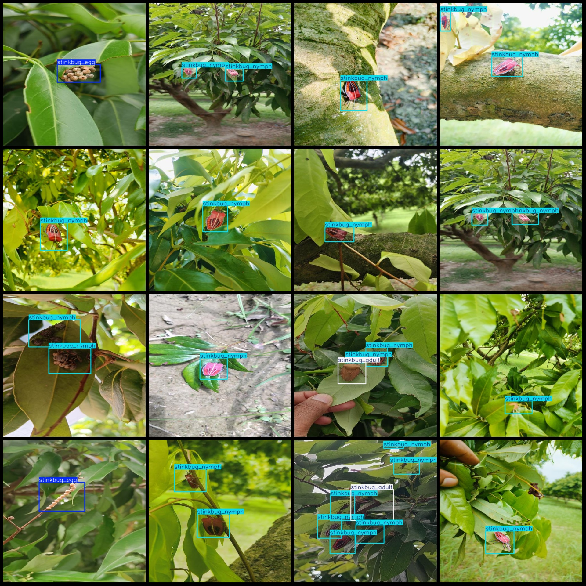
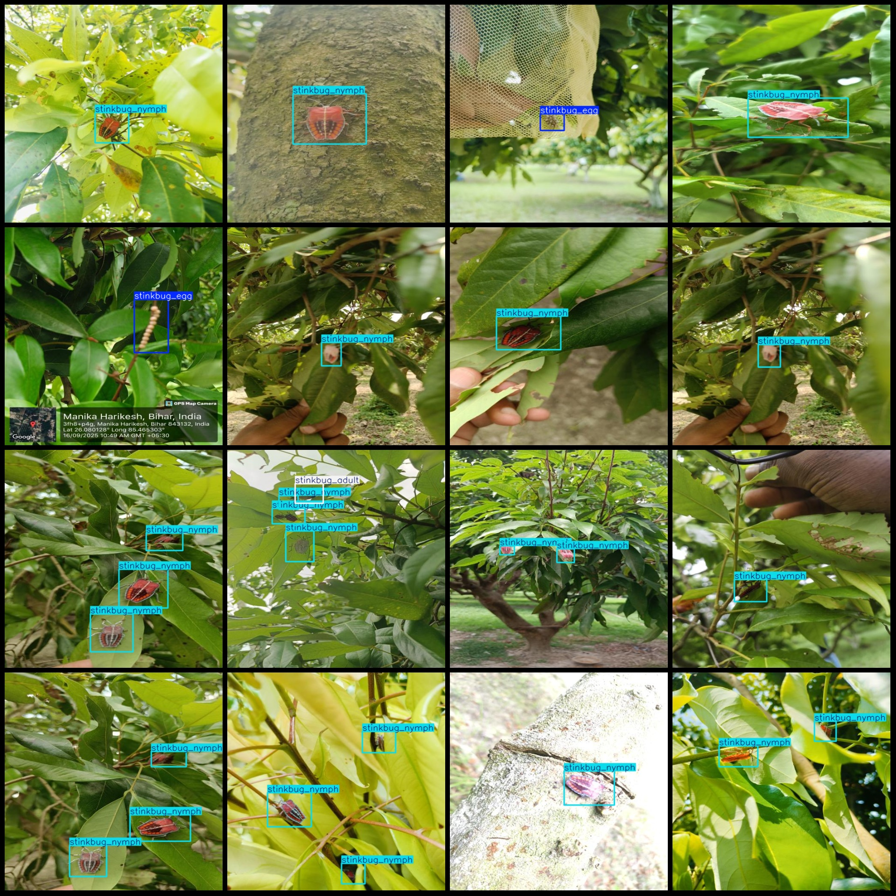

# Smart Orchard Litchi Pest Detection Dataset in VOC+YOLO Format with Enhanced 4 Categories

Please be aware that approximately half of the data set consists of enhanced images, please review the image preview.

Dataset format: Pascal VOC format + YOLO format (txt file without split path, only including jpg images and corresponding VOC format xml file and yolo format txt file)

Number of images (jpg file count): 1499

1499

Number of txt files: 1499

annotationnumber of classes: 4

["stinkbug", "stinkbug_adult", "stinkbug_egg", "stinkbug_nymph"]

Number of bounding boxes labeled in each category:

stinkbug (aphid)

The number of frames for the adult staphylinid, or "stink bug", is 344.

stinkbug_egg(Chrysanthemum beetle egg) box count = 124

The question seems to be asking for the number of stinkbug_nymph (a type of ant) that is represented by the box number 1994. However, this information is not provided in the question and cannot be determined without additional context or data.

Total frames: 2561

Number of images per category:

stinkbug (Cimex lectularius) is a common insect pest that can be found throughout the world. It is known for its distinctive reddish-brown color and its ability to carry diseases to humans through bites.

Stinkbug adult (Chrysomela) occupies 299 images

stinkbug_egg images = 124

The number of images for the stinkbug nymph (Acanthocoris punctipes) is 1141.

Resolution of the image: 512x512

Using the labeling tool: labelImg

Rules for labeling: Draw a box around the category.

Important note: The dataset does not have a separate training, validation, and test set.

Special Disclaimer: This dataset does not guarantee the accuracy of the trained model or weight files.

Preview:

Example:
## Images

Here is a pay link on Stripe ( https://buy.stripe.com/3cs8yP7sY87d0vu9AB ). Please contact me lonlonago@foxmail.com after funding $89, and I will send you a complete data files , thank you!

